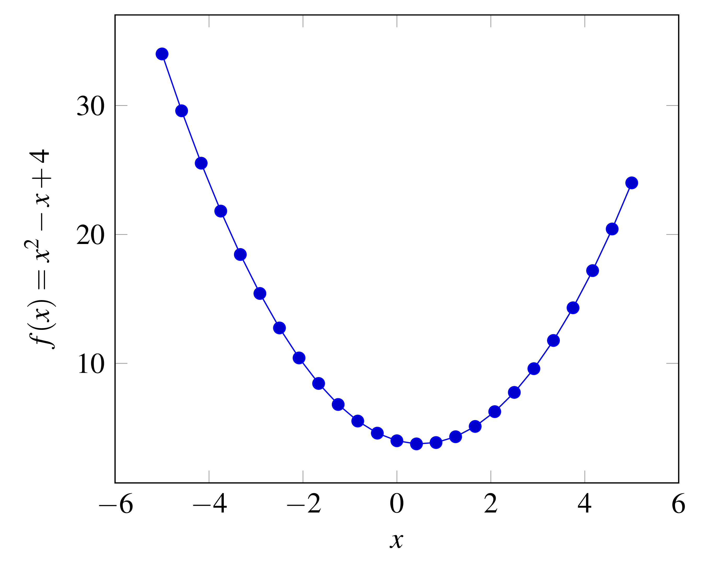

# LaTeXbuilder

LaTeXbuilder facilitates the compilation of latex source code into PDF or PNG file format e.g. for the creation of a PNG image file of a math formula.
It can
- build a PDF or PNG from given LaTeX source code, e.g. a simple formua such as `$\sum P = 0$`
- embed the source code in the PNG file for future modifying of the contents
- build figures created with tikzpicture and/or pgfplots

A commandline interface and rudimentary GUI are available.

The program has so far only been tested with Ubuntu 14.04 and TeX Live.

# Requirements

For the program to work, the following needs to be pre-installed:
- A latex distribution that contains a *pdflatex* implementation (e.g. MiKTeX or TeX Live)
- ImageMagick for the conversion from PDF to PNG

The program uses the following libraries:
- [icafe](https://github.com/dragon66/icafe), a Java library for reading, writing, converting, and manipulating images and metadata. The library is used to embed the LaTeX source code within the built PNG file and to extract the embedded code in PNGs
- [JOpt Simple](https://pholser.github.io/jopt-simple/), a command line option parsing library
- [ini4j](http://ini4j.sourceforge.net/), a Java API for parsing configuration files written in the .ini file format

# Example

The command line interface is used to compile sample code consisting of a plot (http://pgfplots.sourceforge.net/gallery.html).
Source file (pgfplots_example.tex):
```latex
\begin{tikzpicture}
	\begin{axis}[
		xlabel=$x$, ylabel={$f(x) = x^2 - x +4$} ]
		% use TeX as calculator:
		\addplot {x^2 - x +4};
	\end{axis}
\end{tikzpicture}
```

Command to build *pgfplots_example.tex*:

`LaTeXbuilder.jar -b pgfplots_example.tex -o pgfplots_example.png`

Result:


