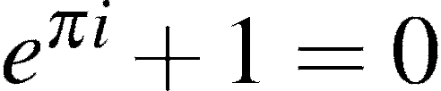
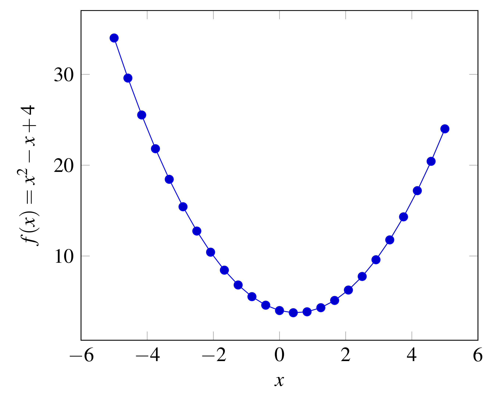
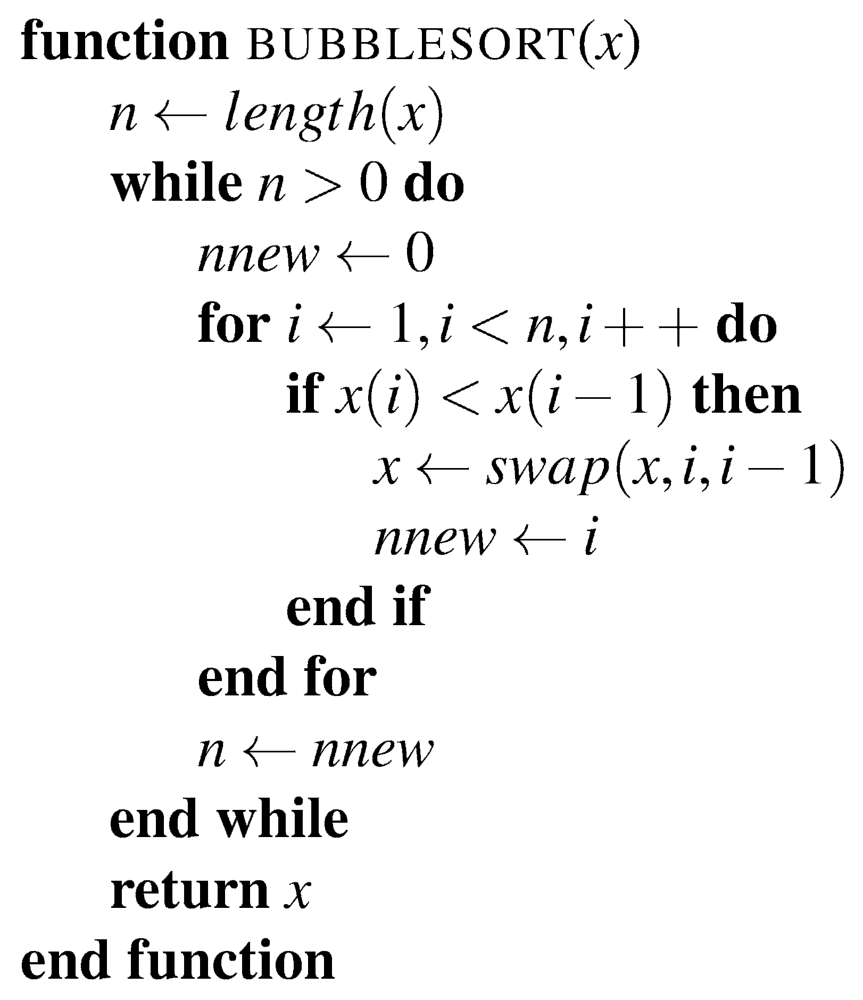
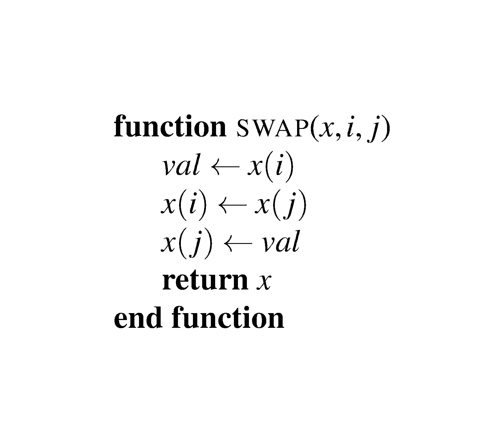

# LaTeXbuilder

LaTeXbuilder facilitates the compilation of latex source code into PDF or PNG file format e.g., for the creation of a PNG image file of a math formula.

**Features (to be extended):**

- Builds a PDF or PNG from given LaTeX source code, e.g. a simple formula such as `$e^{i\pi} + 1 = 0$` &rarr; 
- Embeds the LaTeX source code within the created PNG or PDF meaning that the source code is stored within the output files themselves. Allows for convenient re-loading and modification of the output files with LaTeXbuilder.
- Builds figures created with `tikzpicture` and/or `pgfplots`
- Parses latex code from within ASCII encoded files that contain other arbitrary characters besides LaTeX source code (e.g., source file written in some other programming language)

A command line interface and rudimentary GUI are available.

The program has been tested under *Ubuntu 14.04* and *TeX Live*, and *Windows 7* and *MiKTeX*.

**Libraries used:**

- [icafe](https://github.com/dragon66/icafe), a Java library for reading, writing, converting, and manipulating images and meta data. The library is used to embed the LaTeX source code within the built PNG file and to extract the embedded code within PNGs
- [iText](https://github.com/itext/itextpdf), a Java PDF engine used to embed the LaTeX source code within the built PDF file and to extract the embedded code within PDFs
- [JOpt Simple](https://pholser.github.io/jopt-simple/), a command line option parsing library
- [ini4j](http://ini4j.sourceforge.net/), a Java API for parsing configuration files written in the .ini file format

## Requirements

For the program to work, the following is necessary:
- A latex distribution that contains a *pdflatex* implementation (e.g. MiKTeX or TeX Live)
- ImageMagick for the conversion from PDF to PNG (using `convert`)
- `pdfcrop`, a pearl script that crops PDFs to size; should come with common LaTeX distributions but pearl interpreter should be installed
- *Windows OS users only*: The path to `convert.exe` provided by ImageMagick must be given in `config.ini` (e.g. `
path = C:\Program Files (x86)\ImageMagick-6.9.0-Q16\`) under section `imagemagick`. Unfortunately, another Windows-specific program called 'convert' shadows ImageMagick's `convert.exe`

## Parsing ASCII file & building LaTeX content
The LaTeX code to be read from within an arbitrary ASCII file must be embedded within the following XML tags:
```xml
<latex>
	<file> code.png </file>
	<code>
		$e^{i\pi} + 1 = 0$
	</code>
</latex>
```
At the current stage, the parser only scans for the above tags.

## Examples

### Building a simple plot created with *tikzpicture*
The command line interface is used to compile sample code consisting of a plot.

**Source file *pgfplots_example.tex* (found [here](http://pgfplots.sourceforge.net/gallery.html)):**
```latex
\begin{tikzpicture}
	\begin{axis}[
		xlabel=$x$, ylabel={$f(x) = x^2 - x +4$} ]
		% use TeX as calculator:
		\addplot {x^2 - x +4};
	\end{axis}
\end{tikzpicture}
```

**Build command:**

`LaTeXbuilder.jar -b pgfplots_example.tex -o pgfplots_example.png`

**Result:**

*pgfplots_example.png:*



### Parsing Matlab/Octave source file for LaTeX code, extraction & compilation
The command line interface is used to scan the file *bubblesort.m*, extract and compile the LaTeX code contained within the file.

**Source file *bubblesort.m* (found [here](https://www.mathworks.com/matlabcentral/fileexchange/45125-sorting-methods/content/Sorting%20Methods/bubblesort.m)):**

```matlab
%https://www.mathworks.com/matlabcentral/fileexchange/45125-sorting-methods/content/Sorting%20Methods/bubblesort.m
%{
<latex>
    <file>bubblesort.png</file>
    <code>
        %\begin{algorithm}
            %\caption{A bubble sort algorithm.}
            \begin{algorithmic}
                \Function{bubblesort}{$x$}
                    \State $n \gets length(x)$
                    \While{$n > 0$}
                        \State $nnew \gets 0$
                        \For{$i \gets 1, i < n, i++$}
                            \If{$x(i) < x(i-1)$}
                                \State $x \gets swap(x, i, i-1)$
                                \State $nnew \gets i$
                            \EndIf
                        \EndFor
                        \State $n \gets nnew$
                    \EndWhile
                    \State \Return $x$
                \EndFunction
            \end{algorithmic}
        %\end{algorithm}
    </code>
</latex>
%}
function x = bubblesort(x)
%--------------------------------------------------------------------------
% Syntax:       sx = bubblesort(x);
%
% Inputs:       x is a vector of length n
%
% Outputs:      sx is the sorted (ascending) version of x
%
% Description:  This function sorts the input array x in ascending order
%               using the bubble sort algorithm
%
% Complexity:   O(n)      best-case performance
%               O(n^2)    average-case performance
%               O(n^2)    worst-case performance
%               O(1)      auxiliary space
%
% Author:       Brian Moore
%               brimoor@umich.edu
%
% Date:         January 5, 2014
%--------------------------------------------------------------------------
% Bubble sort
n = length(x);
while (n > 0)
    % Iterate through x
    nnew = 0;
    for i = 2:n
        % Swap elements in wrong order
        if (x(i) < x(i - 1))
            x = swap(x,i,i - 1);
            nnew = i;
        end
    end
    n = nnew;
end

end
%{
<latex>
    <file>swap.png</file>
    <code>
        \begin{algorithmic}
            \Function{swap}{$x,i,j$}
                \State $val \gets x(i)$
                \State $x(i) \gets x(j)$
                \State $x(j) \gets val$
                \State \Return $x$
            \EndFunction
        \end{algorithmic}
    </code>
</latex>
%}
function x = swap(x,i,j)
% Swap x(i) and x(j)
% Note: In practice, x xhould be passed by reference

val = x(i);
x(i) = x(j);
x(j) = val;

end
```
**Build command:**

`LaTeXbuilder.jar --scan bubblesort.m`

**Results:**

For each LaTeX code item encapsulated by the tag `latex`, a separate file is created:

*bubblesort.png*



*swap.png*


